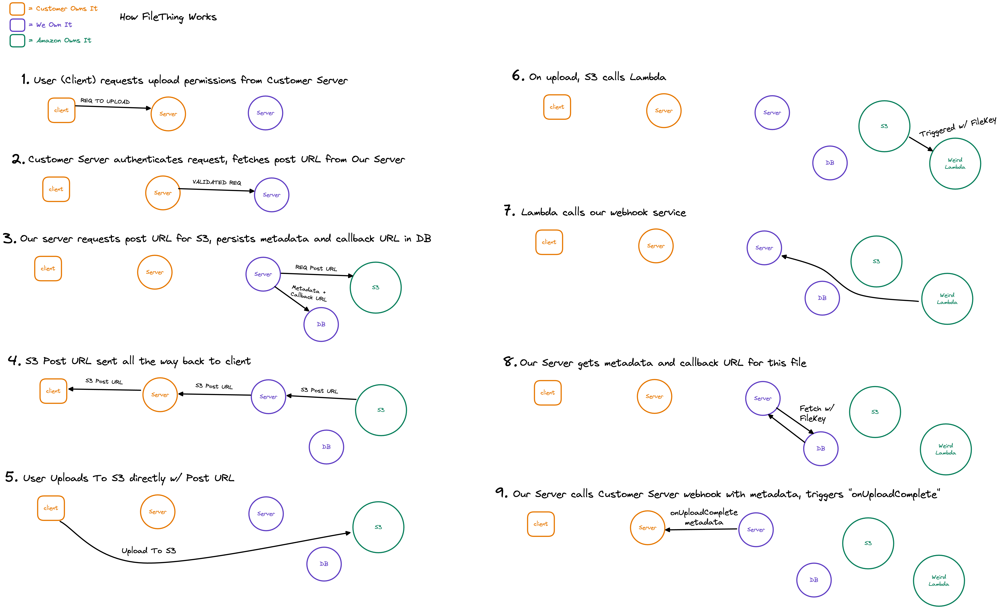

# uploadthing

`npm install uploadthing`

## TODO

### ASAP

- [x] Persisting metadata and file info to db
- [x] Fix metadata in db
- [x] Deploy uploadthing.com
- [x] Set up S3 Webhook callbacks
  - [x] Use DB to callback right func based on upload (wait for all uploads in a given session?)
  - [x] Point S3 at us to receive them
  - [x] Set up WebhookThing in repo for testing
- [x] Auth of some form (we will need secrets for users 😅)
  - [x] This means build a whole webapp
- [x] Typesafe upload RouteSlug management
- [x] Quick copy env vars
- [x] Finish docs
- [x] Publish packages
- [x] Real logo and favicon
- [x] Brand page
- [x] Docs link on homepage
- [x] Fix overflow on homepage
- [x] Analytics tool
- [x] Production should be separate env

### BEFORE SHIP

- [x] Orgs
- [x] Some way of calling `onComplete` during dev (polling?)
- [x] Clean up example site
- [x] 2gb cap
- [x] Copy for homepage
- [x] Rename everything to UploadThing
- [x] Onboarding page in dashboard

### FUTURE

- [x] Regional edge
- [ ] Use non-aws-package for s3 presigned urls
- [ ] Components?
- [ ] Batching and batch behaviors
- [ ] Proxy all S3 calls (use middleware to hide s3 implementation details)
- [ ] Dev keys

## Glossary

- **Customer** - The person or company using uploadthing
- **CustomerServer** - Customer's server, i.e. Vercel, Netlify, AWS, whatever they're hosting
- **User** - The person/client using Customer's product to upload

### uploadthing Package Terms (Things Customers Should Know)

- **RouteSlug** - Unique upload endpoint identifiers (in FileRoutes)
- **FileRoute** - A method of uploading files, similar to a route for a page. Many can be defined in one **FileRouter**
- **FileRouter** - An object with many **FileRoutes**. Similar to a router for a page. This is served by **CustomerServer**
- **UploadMiddleware** - A function that runs before a file is uploaded. It can be used to validate the request, or to add metadata to the file. It can also be used to throw an error to prevent the upload from happening.
- **onUploadComplete** - A function that runs on **CustomerServer** when the upload is complete (we trigger this via webhook)

### File Terms (Implementation Details For Us)

- **FileKey** - Unique file identifiers
- **FileMetadata** - Metadata about a file (e.g. name, size, type, etc)
- **UploadMetadata** - Metadata that **Customer** tags files with
- **CallbackUrl** - A url to **Customer**'s server, triggers `onUploadComplete` for a given upload via webhook

## How It Works



```ts
/** app/api/uploadthing/core.ts */
import { createFilething, type FileRouter } from "uploadthing/server";
const f = createFilething();

// FileRouter for your app, can contain multiple FileRoutes
export const ourFileRouter = {
  // Define as many FileRoutes as you like, each with a unique routeSlug
  imageUploader: f
    // Set permissions and file types for this FileRoute
    .fileTypes(["image", "video"])
    .maxSize("1GB")
    .middleware(async (req) => {
      // This code runs on your server before upload
      const user = await auth(req);

      // If you throw, the user will not be able to upload
      if (!user) throw new Error("Unauthorized");

      // Whatever is returned here is accessible in onUploadComplete as `metadata`
      return { userId: user.id };
    })
    .onUploadComplete(async ({ metadata }) => {
      // This code RUNS ON YOUR SERVER after upload
      console.log("Upload complete for userId:", metadata.userId);
    }),
} satisfies FileRouter;

export type OurFileRouter = typeof ourFileRouter;

/** app/api/file/route.ts */
import { uploadRouter } from "./core.ts";
import { createNextRouteHandler } from "uploadthing/server";

export const runtime = "edge"; // Optional, can run on edge

// Export routes for Next App Router (/pages/api support coming soon!)
export const { POST } = createNextRouteHandler({
  router: uploadRouter,
});

/** app/profile/upload-pic.tsx */
("use client");

import type { OurFileRouter } from "./api/file/core";
import Uploader from "@uploadthing/uploader";

export default function UploadPic() {
  return <Uploader<OurFileRouter> route={"imageUploader"} />;
}
```
