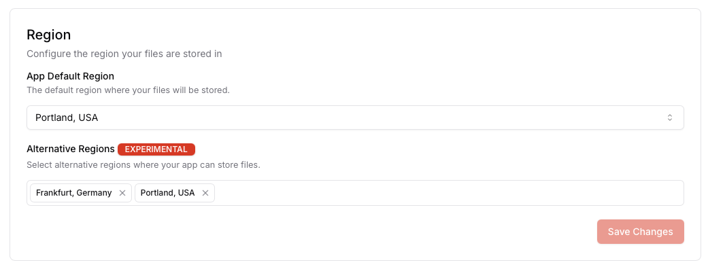

import { docsMetadata } from "@/lib/utils";

export const metadata = docsMetadata({
  title: "Regions & ACL",
  description:
    "UploadThing has support for multiple regions and access control lists to help you secure your files",
  category: "Concepts",
});

<Note>Regions and Private files are only available on paid plans.</Note>

## Regions

UploadThing allows you to select where your files are stored by configuring your
app's region on the UploadThing dashboard. If no configuration is set, your
files are uploaded to our default region which is currently `AWS us-west-2`.

### Available regions

The following regions are currently supported by UploadThing:

| Region                          | Region Alias |
| ------------------------------- | ------------ |
| Asia - Mumbai                   | bom1         |
| Asia - Seoul                    | icn1         |
| Asia - Sydney                   | syd1         |
| Canada - Central                | can1         |
| EU Central - Frankfurt          | fra1         |
| EU Central - Zurich             | zrh1         |
| EU West - Dublin                | dub1         |
| US East - Ohio                  | cle1         |
| US West - San Fransisco         | sfo1         |
| US West - Seattle **(default)** | sea1         |

### Configuring region

Go to your app's settings on the UploadThing dashboard. Under `Regions and ACL`,
you can select the region you want to upload your files to. Once changed, all
**new** file uploads will go to the selected region.


<Note>
  Changing your app's region will not move your existing files to the new
  region, it will only affect new files. For assistance migrating your existing
  files to the new region, please reach out on [Discord](https://t3.gg/discord)
  or via [email](mailto:ut-support@ping.gg).
</Note>

### Dynamic region selection

UploadThing allows you to seamlessly select the region based on the user's
location. This is useful for applications that are global and want to upload
files to the region closest to the user for lower latencies.

<Note>
  This feature is currently in private beta. Please reach out to us on
  [support@uploadthing.com](mailto:support@uploadthing.com) if you're interested
  in enrolling.
</Note>

Once enabled, you can upload to any region you have enabled on your app in the
dashboard:



Then, in your middleware, tag the upload's metadata with the
`experimental_UTRegion` key:

```ts
export const uploadRouter = {
  anyPrivate: fileRoute({
    blob: { maxFileSize: "256MB", maxFileCount: 10, acl: "public-read" },
  })
    .input(z.object({}))
    .middleware(async (opts) => {
      /**
       * Simple example using continent code to select region.
       *
       * Europe and Africa will be routed to Frankfurt,
       * Asia to Mumbai (India), and the rest to Virginia (US-East).
       *
       * You can do this selection however you like.
       */
      const region =
        (
          {
            AF: "fra1",
            AN: "sea1",
            AS: "bom1",
            EU: "fra1",
            NA: "sea1",
            OC: "sea1",
            SA: "sea1",
          } as const
        )[opts.req.headers.get("x-vercel-ip-continent")?.toUpperCase()] ??
        "sea1"; // Fallback

      return { [experimental_UTRegion]: region }; // <-- Tag the upload with the selected region
    })
    .onUploadComplete(async (opts) => {
      console.log("Upload complete", opts.file);
    }),
} satisfies FileRouter;
```

## Access Controls

By default every file uploaded to UploadThing is accessible simply by it's URL
(`<APP_ID>.ufs.sh/f/<FILE_KEY>`). Although this hard-to-guess URL is fine for
many applications, some applications require a more secure way to store their
files.

You can configure your app's access control list (ACL) to restrict access to
your files. UploadThing currently supports two different ACLs:

- `public-read`: Files will be accessible simply by it's URL.
- `private`: Private files will not be accessible by it's URL, but instead will
  require a short-lived signed URL to be accessed.

### Configuring ACL

To configure your app's ACL, go to your app's settings on the UploadThing
dashboard. Under `Regions and ACL`, you can select the ACL you want to use as
default. You may also toggle the ability to override the default ACL on a
per-request basis.


### Using signed URLs

Signed URLs can be generated using the
[`generateSignedURL`](/api-reference/ut-api#generate-signed-url) method on the
UTApi. It accepts the expiration time in seconds as a parameter.
