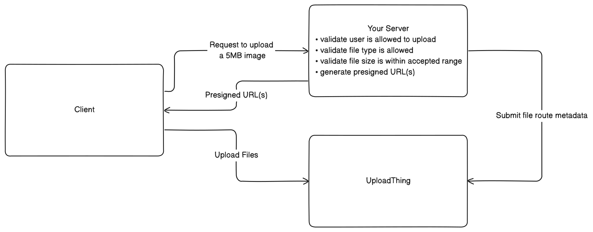
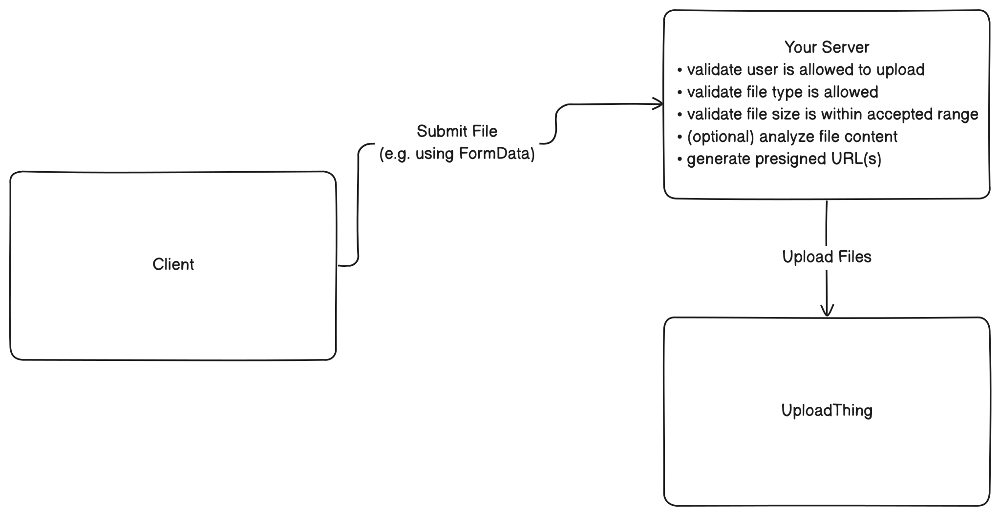

import Image from "next/image";
import { docsMetadata } from "@/lib/utils";

export const metadata = docsMetadata({
  title: "Uploading Files",
  description:
    "Uploading files is the first step in the process of uploading files to UploadThing. This page explains the general process of uploading files and how you can use the UploadThing API to upload files. There are two ways to upload files to UploadThing:",
  category: "Concepts",
});

# Uploading Files

<Warning>This is outdated and must be updated to v7 and ingest server.</Warning>

Uploading files is the first step in the process of uploading files to
UploadThing. This page explains the general process of uploading files and how
you can use the UploadThing API to upload files. There are two ways to upload
files to UploadThing:

## Client Side Uploads

The most common approach to uploading files is to use client-side uploads. With
client side uploads, you do not have to pay ingress / egress fees for
transferring the files binary data through your server. Your server instead will
generate presigned URLs which the client will then use to upload the files to
UploadThing.



<Note>
  The UploadThing SDKs provide a convenient way to perform client-side uploads
  using [File Routes](/file-routes) that let you define what type of files are
  allowed for each route, how large the files can be and how many files can be
  uploaded. You can also define middleware validation based on the request to
  [authenticate the
  user](/concepts/auth-security#protecting-unauthenticated-users-from-uploading-files)
  before continuing the upload process.
</Note>

The easiest way to get started with client-side uploads it to define a
[File Router](/file-routes), expose it on your server using one of our adapters
[route handlers](/api-reference/server#create-route-handler), and then upload
the files using our built-in components or upload helpers. Here are some
examples that should fit most of your needs, no matter what framework you're
using:

| Framework            | Docs                                                                                                                                     | Example                                                                                                                        |
| -------------------- | ---------------------------------------------------------------------------------------------------------------------------------------- | ------------------------------------------------------------------------------------------------------------------------------ |
| Backend Adapters     | [Express](/backend-adapters/express), [Fastify](/backend-adapters/fastify), [Fetch](/backend-adapters/fetch), [H3](/backend-adapters/h3) | [backend-adapters/server](https://github.com/pingdotgg/uploadthing/tree/main/examples/backend-adapters/server)                 |
| Vanilla JavaScript   | [API Reference - Client](/api-reference/client)                                                                                          | [backend-adapters/client-vanilla](https://github.com/pingdotgg/uploadthing/tree/main/examples/backend-adapters/client-vanilla) |
| React                | [API Reference - React](/api-reference/react)                                                                                            | [backend-adapters/client-react](https://github.com/pingdotgg/uploadthing/tree/main/examples/backend-adapters/client-react)     |
| Vue.js               | -                                                                                                                                        | [backend-adapters/client-vue](https://github.com/pingdotgg/uploadthing/tree/main/examples/backend-adapters/client-vue)         |
| Next.js App Router   | [Next.js App Router Setup](/getting-started/appdir)                                                                                      | [minimal-appdir](https://github.com/pingdotgg/uploadthing/tree/main/examples/minimal-appdir)                                   |
| Next.js Pages Router | [Next.js Page Router Setup](/getting-started/pagedir)                                                                                    | [minimal-pagedir](https://github.com/pingdotgg/uploadthing/tree/main/examples/minimal-pagedir)                                 |
| SolidStart           | [SolidStart Setup](/getting-started/solid)                                                                                               | [minimal-solidstart](https://github.com/pingdotgg/uploadthing/tree/main/examples/minimal-solidstart)                           |
| Astro                | [Getting Started with Astro](/getting-started/astro)                                                                                     | [minimal-astro-react](https://github.com/pingdotgg/uploadthing/tree/main/examples/minimal-astro-react)                         |
| SvelteKit            | [Getting Started with SvelteKit](/getting-started/svelte)                                                                                | [minimal-sveltekit](https://github.com/pingdotgg/uploadthing/tree/main/examples/minimal-sveltekit)                             |
| Nuxt                 | [Getting Started with Nuxt](/getting-started/nuxt)                                                                                       | [minimal-nuxt](https://github.com/pingdotgg/uploadthing/tree/main/examples/minimal-nuxt)                                       |

If none of the above suits your needs, you can also use the
[OpenAPI specification](/api-reference/openapi-spec) to build your own SDKs. In
the following sections, we will describe how to do just that.

### Building the backend adapter

The first step is to build a backend adapter. The adapter will be responsible
for receiving the client request, validating that the request conforms to your
requirements, and then retrieving and sending back the presigned URLs to the
client.

We will not go in depth on the details here, however, you can refer to the
implementations of the official
[TypeScript SDK](https://github.com/pingdotgg/uploadthing/blob/3376306731d34c36fea8df3c6b117eeb17328f0f/packages/uploadthing/src/internal/handler.ts#L84-L109)
or the
[community Python SDK](https://github.com/juliusmarminge/uploadthing-py/blob/07b57ede675440881f311f63c166fdfcca2b5880/uploadthing_py/request_handler.py#L244)
for reference.

If you want your adapter to be compatible with the official frontend SDKs, it
should follow this interface:

- `GET /api/uploadthing`

  - Input Query Parameters: None
  - Output JSON:
    [`EndpointMetadata`](https://github.com/pingdotgg/uploadthing/blob/3376306731d34c36fea8df3c6b117eeb17328f0f/packages/shared/src/types.ts#L115-L118)

- `POST /api/uploadthing`

  - Input Query Parameters:
    - `slug: string`: The slug of the file route
    - `actionType: "upload"`: The action type of the file route the client wish
      to perform
  - Input / Output JSON:
    [Depends on action](https://github.com/pingdotgg/uploadthing/blob/65565d907bd1671fbede5a8eb82a4eab250b4198/packages/uploadthing/src/internal/types.ts#L231-L236)

### Generating presigned URLs

Once your backend adapter has received and validated the request, you will next
need to generate presigned URLs. First, generate some file keys for the files to
be uploaded.

To generate a file key, generate a [Sqids](https://sqids.org/) of your appId
with `{ minLength: 12 }`, then concatenate this with a file seed of your choice.
The file seed can be anything you want, but it should be unique for each file,
as well as url safe. In this example, we include a base64 encoding to ensure the
file seed is url safe, but you can do this however you want.

```ts
import SQIds, { defaultOptions } from "sqids";

// A simple function to shuffle the alphabet for the Sqids
function shuffle(str: string, seed: string) {
  const chars = str.split("");
  const seedNum = Hash.string(seed);

  let temp: string;
  let j: number;
  for (let i = 0; i < chars.length; i++) {
    j = ((seedNum % (i + 1)) + i) % chars.length;
    temp = chars[i];
    chars[i] = chars[j];
    chars[j] = temp;
  }

  return chars.join("");
}

function generateKey(
  appId: string,
  fileSeed: string,
) =>
  // Hash and Encode the parts and apiKey as sqids
  const alphabet = shuffle(defaultOptions.alphabet, appId);

  const encodedAppId = new SQIds({ alphabet, minLength: 12 }).encode([
    Math.abs(Hash.string(appId)),
  ]);

  // We use a base64 encoding here to ensure the file seed is url safe, but
  // you can do this however you want
  const encodedFileSeed = encodeBase64(fileSeed);

  return `${encodedAppId}:${encodedFileSeed}`;
}
```

The URL, to which you will upload the file, will depend on your app's region.
You can find the list of regions in the
[regions documentation](/concepts/regions-acl#regions). The upload URL can then
be constructed using the following format:

`https://{{ REGION_ALIAS }}.ingest.uploadthing.com/{FILE_KEY}`

Next, generate a signed URL by appending some query parameters to the upload
URL, and finally a `signature` parameter containing the HMAC SHA256 digest of
the URL:

```ts
const searchParams = new URLSearchParams({
  // Required
  expires: Math.floor(Date.now() / 1000) + 3600, // 1 hour from now (you choose)
  "x-ut-identifier": "MY_APP_ID",
  "x-ut-file-name": "my-file.png",
  "x-ut-file-size": 131072,
  "x-ut-slug": "MY_FILE_ROUTE",

  // Optional
  "x-ut-file-type": "image/png",
  "x-ut-custom-id": "MY_CUSTOM_ID",
  "x-ut-content-disposition": "inline",
  "x-ut-acl": "public-read",
});

const url = new URL(
  `https://{{ REGION_ALIAS }}.ingest.uploadthing.com/${fileKey}`,
);
url.search = searchParams.toString();

const signature = hmacSha256(url, apiKey);
url.searchParams.append("signature", signature);
```

<Warning>
  The upload will fail if any parameter doesn't match the uploaded file (e.g.
  the file is larger than the specified size). Constructing invalid file keys
  will also result in an error.
</Warning>

Return the signed URL(s) to the client.

### Registering the upload

As you return the signed URL(s) to the client and the client starts uploading,
you'll need to register the upload to UploadThing. This is so that the metadata,
the result of running the
[file route middleware](/api-reference/server#file-routes), can be retrieved
later. Include also the callback URL and slug, this will be used by UploadThing
to callback your server when the upload has been completed so that you can run
the `onUploadComplete` / `onUploadError` callbacks for the upload.

```sh
curl -X POST https://{{ REGION_ALIAS }}.ingest.uploadthing.com/route-metadata \
    --header 'content-type: application/json' \
    --header 'x-uploadthing-api-key: YOUR_API_KEY' \
    --data '{
        "fileKeys": [
          "KEY_1",
        ],
        "metadata": {
          "uploadedBy": "user_123"
        },
        "callbackUrl": "https://your-domain.com/api/uploadthing",
        "callbackSlug": "imageUploader",
        "awaitServerData": false,
        "isDev": false
    }'
```

The two boolean flags are optional, and used to alter the behaviour of the
upload.

- `awaitServerData`: If set to `true`, the upload request will not respond
  immediately after file upload, but instead wait for your server to call the
  `/callback-result` endpoint with the result of running the `onUploadComplete`
  callback. **Enable this only if your client needs to get data from the server
  callback as it will increase the duration of the upload.**
- `isDev`: If set to `true`, the response of this request will be a
  `ReadableStream` instead of JSON. The stream will be open for the duration of
  the upload and enqueue chunks as files are uploaded. This is in exchange of
  callback requests when your dev server cannot be reached from external
  servers. Each chunk will be a JSON string containing `payload`, `signature`
  and `hook`. Forward these to send a request to your dev server to simulate the
  callback request in development.

  ```sh
  curl -X POST http://localhost:3000/api/uploadthing \
    --header 'content-type: application/json' \
    --header 'x-uploadthing-signature: {{ SIGNATURE }}' \
    --header 'uploadthing-hook: {{ HOOK }}' \
    --data '{{ PAYLOAD }}'
  ```

### Uploading the files

Uploading the files is as simple as submitting a PUT request to the signed URL.

```ts
const formData = new FormData();
formData.append("file", file);

await fetch(presigned.url, {
  method: "PUT",
  body: formData,
});
```

If you want to implement resumable uploads, you can additionally include the
`Range` header in the request, with the starting byte offset. To get the range
start, you can send a HEAD request to the presigned URL and get the
`x-ut-range-start` header.

```ts
const rangeStart = await fetch(presigned.url, { method: "HEAD" }).then((res) =>
  parseInt(res.headers.get("x-ut-range-start") ?? "0", 10),
);
await fetch(presigned.url, {
  method: "PUT",
  headers: {
    Range: `bytes=${rangeStart}-`,
  },
  body: file.slice(rangeStart),
});
```

### Handling the callback request

When your file has been uploaded, the UploadThing API will send a callback
request (similar to a webhook) to the `callbackUrl` you provided when requesting
the presigned URLs. The callback request will contain the file information along
with the `metadata`.

<Note>
  As explained earlier, if the `isDev` flag is set to `true`, you'll have to
  simulate this request yourself using the received chunks from the readable
  stream.
</Note>

You can identify the hook by the presence of the `uploadthing-hook` header and
verify it using the `x-uploadthing-signature` header. The signature is a HMAC
SHA256 of the request body signed using your API key, which you can verify to
ensure the request is authentic and originates from the UploadThing server.

After you have verified the request is authentic, run the `onUploadComplete`
function for the file route. The data returned from the callback can then be
submitted back to the UploadThing API using the `/callback-result` endpoint.
Once the data has been submitted, the client upload request will finish assuming
the `awaitServerData` flag was set to `true` when registerring the upload in a
previous step.

Congratulations, you have now uploaded your files to UploadThing.

## Server Side Uploads

Sometimes you may either produce the file on your server, or want to validate
the file's content before uploading it. In these cases, you can use server-side
uploads and first submit the files to your server and then from your server
upload the files to UploadThing.



<Note>
  For server-side uploads, you will need to do your own validation based on your
  needs, the upload request does not go through any file router. You can use the
  [UTApi.uploadFiles](/api-reference/ut-api#upload-files) method to upload the
  files after you have validated and processed the request.
</Note>

Going forward, we will assume you have already received the file on your server,
for example using FormData from a file upload form.

Fortunately, server side uploads are very straight forward, and in many ways
similar to client side uploads. Generating presigned URLs is the same for
server-side uploads as for client-side uploads. The only difference is that you
do not have to include the `x-ut-slug` search parameter in the URL.

After you have generated the presigned URLs, you can upload the files to
UploadThing using the same steps as explained for client-side uploads. The
response of the request will contain the file information for successful
uploads, or an error message if the upload failed.

And that's it. There is no need to register the upload to UploadThing, or handle
any callback requests when doing server-side uploads.
