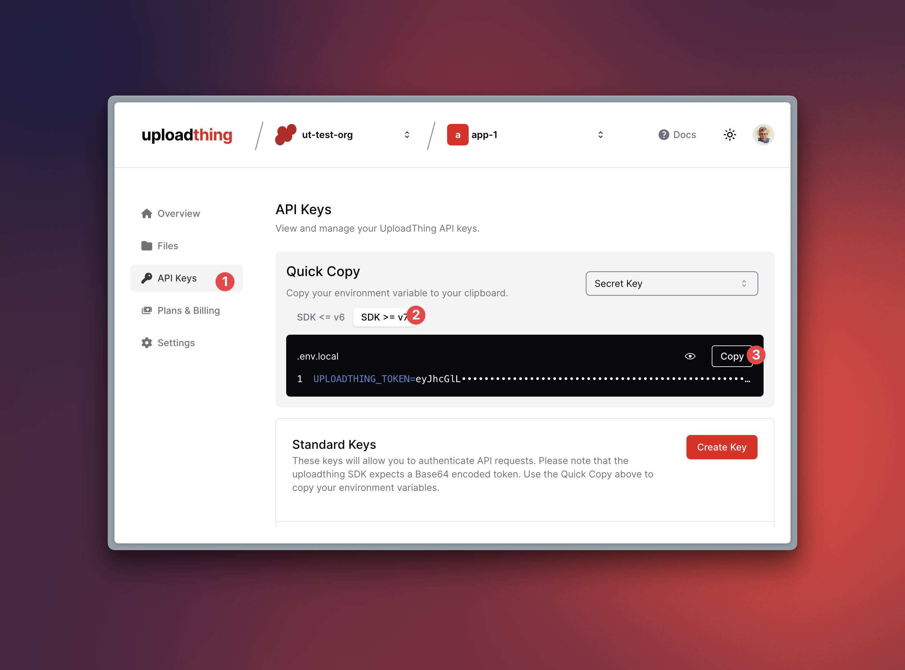

import { docsMetadata } from "@/lib/utils";

export const metadata = docsMetadata({
  title: "Migrate from v6 to v7",
  description:
    "Version 7 of UploadThing is a big release backed by all new infrastructure along with a nearly full rewrite of the internals.",
  category: "Migration Guides",
});

# Migrate from v6 to v7

Version 7 of UploadThing is a big release backed by all new infrastructure along
with a nearly full rewrite of the internals.

- We've reduced the client-side bundle size by 35%. This is in addition to the
  70% reduction in a recent minor release. `uploadthing/client` now loads just
  over 25kB of JavaScript.
- Resumable uploads are now supported
- We've re-architected the backend to require less round-trips to the
  UploadThing server, take advantage of modern web advancements, and removed all
  polling logic. All of thesechanges results in a much faster upload experience.
- We've begun work on a self-hosted version of UploadThing (more info coming
  soon)

In this guide, we'll walk you through the steps to migrate from v6 to v7 and
list all the breaking changes and the new features.

## `UPLOADTHING_SECRET` is now `UPLOADTHING_TOKEN` {{ tag: 'BREAKING' }}

In prior versions of Uploadthing, presigned urls were generated on our servers,
and fetched from your backend using authenticated API calls. With v7, we have
moved the generation of presigned urls to your server, meaning you can there is
no need for the extra API call.

With this change, however, your server needs to know more about your app in
order to generate presigned URLs; such as the app id and region. We didn't want
to require additional environment variables, so we've decided to merge the
required information into a single `UPLOADTHING_TOKEN` environment variable.

The token is a base64 encoded JSON object that contains information such as your
app id, the app region as well as the API key. The token is available in the
[UploadThing Dashboard](https://dashboard.uploadthing.com) under `API Keys` and
selecting the `V7` tab:



If you previously passed in the API key as a configuration object, the keys in
the `config object have changed to reflect the new token structure.

```ts
import { createRouteHandler } from "uploadthing/server";

createRouteHandler({
  router,
  config: {
    uploadthingSecret: "", // [!code --]
    uploadthingAppId: "", // [!code --]
    token: "", // [!code ++]
  },
});
```

## `createRouteHandler` from `uploadthing/server` now returns a single handler {{ tag: 'BREAKING' }}

Previously, `createRouteHandler` from `uploadthing/server` returned separate
named functions for `GET` and `POST` methods. The routing logic has been moved
to the internals, meaning we now return a single handler for all methods.

```ts
import { createRouteHandler } from "uploadthing/server";

import { uploadRouter } from "~/uploadthing/router";

const { GET, POST } = createRouteHandler({ router }); // [!code --]
const handler = createRouteHandler({ router }); // [!code ++]
```

If your framework expects named exports for each method, you can re-export the
handler as such:

```ts
import { createRouteHandler } from "uploadthing/server";

import { uploadRouter } from "~/uploadthing/router";

const handler = createRouteHandler({ router, config });
export { handler as GET, handler as POST };
```

<Note>
  The Next.js adapter still returns named exports for `GET` and `POST` methods.

```ts
import { createRouteHandler } from "uploadthing/next";

import { uploadRouter } from "~/uploadthing/router";

export const { GET, POST } = createRouteHandler({ router });
```

</Note>

## `genUploader` now returns an object {{ tag: 'BREAKING' }}

Along with the introduction of [resumable uploads](#resumable-uploads), we've
introduced a new `createUpload` function that allows you to create a new upload.

The `genUploader` function now returns an object with two functions,
`uploadFiles` and `createUpload`. To migrate:

```ts
import { genUploader } from 'uploadthing/client'
import type { UploadRouter } from '~/uploadthing/router'

const uploadFiles = genUploader<UploadRouter>() // [!code --]
const { uploadFiles, createUpload } = genUploader<UploadRouter>() // [!code ++]
```

## Log levels has changed {{ tag: 'BREAKING' }}

Internally, we've changed the logging from using `Consola` to `effect/Logger. In
alignment with that change, the log level naming has changed.

```ts
import { createRouteHandler } from "uploadthing/server";

import { uploadRouter } from "~/uploadthing/router";

const handler = createRouteHandler({
  router,
  config: {
    logLevel: "error" | "warn" | "info" | "debug" | "trace", // [!code --]
    logLevel: "Fatal" | "Error" | "Warning" | "Info" | "Debug" | "Trace", // [!code ++]
  },
});
```

The same change applies to
[`UTApi`'s constructor options](/api-reference/ut-api#constructor).

## `skipPolling` has been moved {{ tag: 'BREAKING' }}

In v6 we introduced the ability to return data from your server-side
`onUploadComplete` callback that would be sent along to the client-side
`onClientUploadComplete` callback. This required the client to wait for extra
round-trips as your server callback ran and eventually finished, sent back the
data to the uploadthing server which then would respond with the data to the
client. If you got "unlucky" with the polling, this could take a long time.
Additionally, we found that this feature was not used by many people,
essentially just delaying the client-side callback for no benefit in the
majority of cases.

In 6.5, we attempted to address this by
[introducing a client-side option `skipPolling`](https://github.com/pingdotgg/uploadthing/pull/642)
that allowed you to opt-out of this behaviour for a faster upload experience.
This was a non-breaking change that the majority could enable without any
downside, but in order to be non-breaking, could not not be default, and thus
was not an ideal solution.

In v7, we're moving this option to the server-side route configuration so that
you have all the configuration for a given file route in one place.

```ts
// On the client
await uploadFiles("myUploader", {
  files: [ ... ],
  // Opt-out of waiting for server data
  skipPolling: true // [!code --]
})
```

```ts
// On the server
import { createUploadThing } from "uploadthing/server";

const f = createUploadThing();

export const uploadRouter = {
  myUploader: f(
    { image: { maxFileSize: "16MB" } },
    // Opt-out of waiting for server data
    { awaitServerData: false }, // [!code ++]
  ),
};
```

## Deprecations have been removed {{ tag: 'BREAKING' }}

The following we're previously deprecated and have now been removed:

- `@uploadthing/react` no longer exports `generateComponent`. Use
  `generateUploadButton` and `generateUploadDropzone` instead.

  ```ts
  import { generateComponent } from '@uploadthing/react' // [!code --]
  const { UploadButton } = generateComponent() // [!code --]
  import { generateUploadButton } from '@uploadthing/react' // [!code ++]
  const UploadButton = generateUploadButton() // [!code ++]
  ```

- `@uploadthing/react/hooks` entrypoint has been removed. Use the main
  entrypoint instead.

  ```ts
  import { generateReactHelpers } from '@uploadthing/react/hooks' // [!code --]
  import { generateReactHelpers } from '@uploadthing/react' // [!code ++]
  ```

- `useUploadThing` hook result no longer returns `permittedFileInfo`. Use
  `routeConfig` instead.

  ```ts
  const { permittedFileInfo } = useUploadThing(...) // [!code --]
  //      ^? { config: RouteConfig; slug: string } // [!code --]
  const { routeConfig } = useUploadThing(...) // [!code ++]
  //      ^? RouteConfig // [!code ++]
  ```

- Adapter-specific named exports (e.g. `createUploadthingExpressHandler`) have
  been removed. All adapters exports `createRouteHandler` as a unified naming
  convention.

  ```ts
  import {
    createRouteHandler, // [!code ++]
    createUploadthingExpressHandler, // [!code --]
  } from "uploadthing/express";
  ```

## Remove dependency `tailwind-merge` {{ tag: 'BREAKING' }}

We have removed the dependency `tailwind-merge` from the core client libs. Some
users may still require `tailwind-merge` if you
[are theming components with TailwindCSS](/concepts/theming#theming-with-tailwind-css),
in which case you can use the `config` prop to override the default class merger
to use something like `tailwind-merge` instead of the default class merger
(which is a simple `classes.join(' ')`):

```tsx
import { twMerge } from 'tailwind-merge'
import { UploadButton } from '~/lib/uploadthing'

export function Page() {
  return (
    <UploadButton
      ...
      config={{ cn: twMerge }}
    />
  )
}
```

## New configuration provider {{ tag: 'FEATURE', tagColor: 'emerald' }}

In v7, we've introduced a new configuration provider that allows you to
configure UploadThing more easily. All the options that can be passed in as a
configuration object (e.g. `createRouterHandler#config`) can now also be passed
as an environment variable in constant case prefixed with `UPLOADTHING`.

```ts
const api = new UTApi({
  logLevel: 'Info',
})

// is the same as
process.env.UPLOADTHING_LOG_LEVEL = 'Info'
const api = new UTApi()
```

<Note>
  If both configuration methods are passed, the options object will always take
  precedence.
</Note>

## Resumable uploads {{ tag: 'FEATURE', tagColor: 'emerald' }}

You can now build resumable upload flows using the `createUpload` function from
`uploadthing/client`. Resumable uploads can be paused and resumed at any time as
long as the presigned URL is still valid.

📚 Read more about resumable uploads [here (TODO)](#resumable-uploads).

## The UploadThing REST API has moved {{ tag: 'MISC', tagColor: 'amber' }}

The UploadThing REST API has been moved to a separate domain,
`api.uploadthing.com`. The old API at `uploadthing.com/api` now redirects to the
new API. Check out the [API Reference](/api-reference/openapi-spec) for more
information.

Please note that previously we required the SDK version to be passed as a
header. The new API has explicit path-based versioning, meaning the
`x-uploadthing-version` header is no longer required.

```sh
// Old API
curl -X POST https://uploadthing.com/api/listFiles \
  -H 'x-uploadthing-version: 6.12.0' \
  ...

// New API
curl -X POST https://api.uploadthing.com/v6/listFiles \
  ...
```
