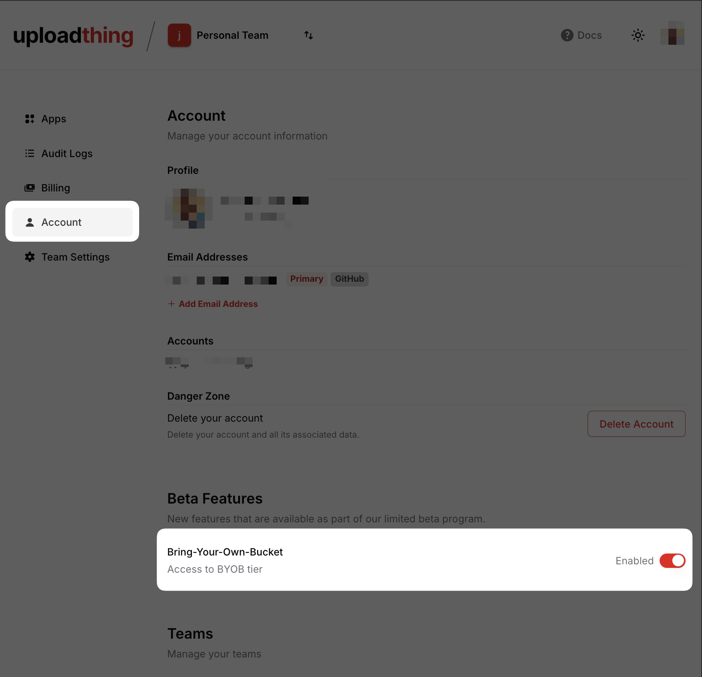

import { ArticleLayout } from "@/app/blog/_components/layouts";
import { blogMetadata } from "@/lib/utils";

export const article = {
  authors: [
    {
      name: "",
      role: " @ Ping Labs",
      src: "https://github.com/.png",
      href: "https://x.com/",
    },
  ],
  date: "2024-09-13",
  title: "Usage based pricing",
  description:
    "Usage based pricing is now available for all UploadThing users.",
  tags: ["product"],
  image: "/images/blog/v7-launch-og.png",
};
export const metadata = blogMetadata(article);

export const dynamic = "force-static";

export default (props) => <ArticleLayout article={article} {...props} />;

# Usage based pricing is now available for all UploadThing users

Starting today, all UploadThing users can now opt-in to usage based pricing.
With usage based pricing, your app will be unlocked to upload as many files as
you want. Pricing starts at $25/month with 250GB of storage included and $0.08
for every GB above this baseline.

## Bring your own Bucket is now available in public beta

Usage based pricing also comes with the ability to bring your own bucket for
those who wants full control overe your data. We're starting by rolling this out
in public beta and you can opt into this by toggling the feature flag in your
account settings, after which you'll be able to create a new app with this tier.

